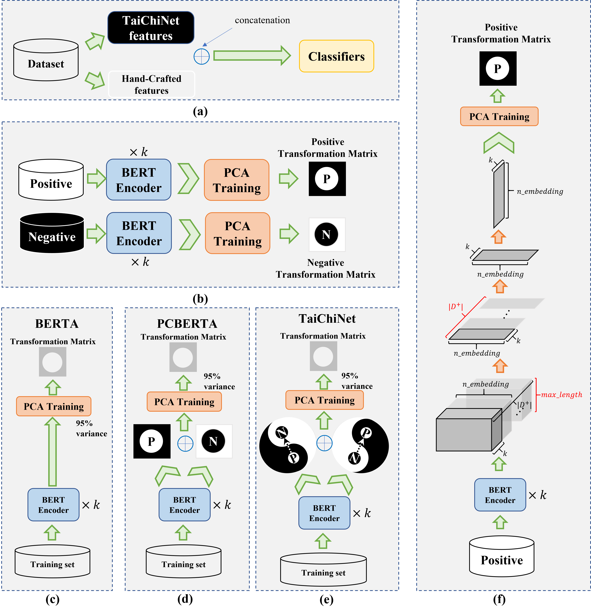
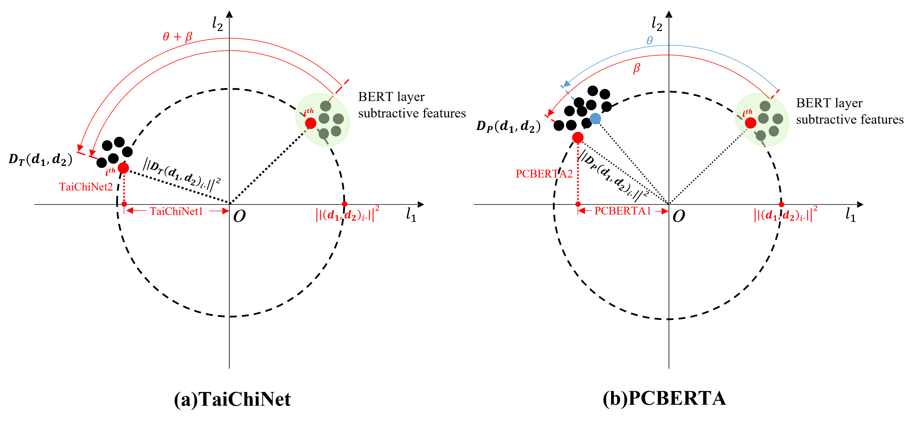
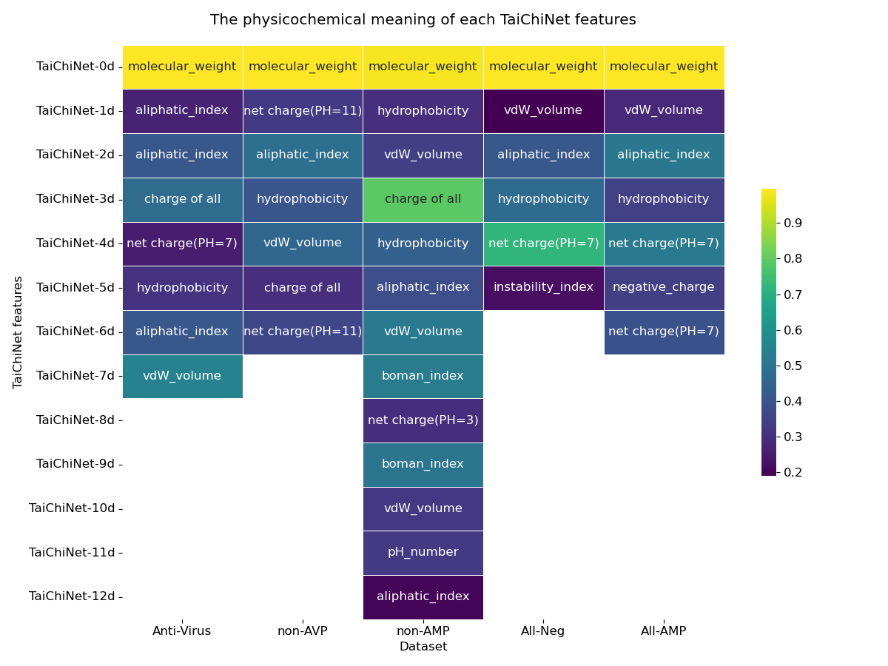

# TaiChiNet

Numerous studies have demonstrated that biological sequences, such as DNA, RNA, and peptide, can be considered the "language of life". Utilizing pre-trained language models (LMs) like ESM2, GPT, and BERT have yielded state-of-the-art (SOTA) results in many cases. However, the increasing size of datasets exponentially escalates the time and hardware resources required for fine-tuning a complete LM. This paper assumed that natural language shared linguistic logic with the "language of life" like peptides. We took the LM BERT model as an example in a novel Principal Component Analysis (PCA)-based Ying-Yang dilution network of the inter- and intra-BERT layers, termed TaiChiNet, for feature representation of peptide sequences. The Ying-Yang dilution architecture fuses the PCA transformation matrices trained on positive and negative samples, respectively. We transferred the TaiChiNet features into a subtractive layer feature space and observed that TaiChiNet just rotated the original subtractive features with a certain angle and didn’t change the relative distance among the dimensions. TaiChiNet-engineered features together with the hand-crafted (HC) ones were integrated for the prediction model of anti-coronavirus peptides (TaiChiACVP). Experimental results demonstrated that the TaiChiACVP model achieved new SOTA performance and remarkably short training time on five imbalanced datasets established for the anti-coronavirus peptide (ACVP) prediction task. The decision paths of the random forest classifier illustrated that TaiChiNet features can complement HC features for better decisions. TaiChiNet has also learned the latent features significantly correlated with physicochemical properties including molecular weight. This makes an explainable connection between the deep learning-represented features and the ACVP-associated physicochemical properties. Additionally, we extended our work to the other LMs, including ESM2 with 6 or 12 layers, ProGen2 small and base version, ProtBERT, and ProtGPT2. Due to the limitations of these recent LMs, none of them outperforms TaiChiACVP. However, some limitations of TaiChiNet remained to be investigated in the future, including learnable rotation degrees, extended fusions of more layers, and end-to-end training architecture. 






## Table of Contents

- [Datasets](#datasets)
  - [Get HC features for each datasets](#Get-HC-features-for-each-datasets)
- [Installation](#installation)
- [Usage](#usage)
  - [Get BERT features for each datasets](#Get-BERT-features-for-each-datasets)
  - [Get results of each BERT layers features](#Get-results-of-each-BERT-layers-features)
  - [Get results of BERTA for each layer to calcualte BF](#Get-results-of-BERTA-for-each-layer-to-calcualte-BF)
  - [Run the classification results of TaiChiACVP](#Run-the-classification-results-of-TaiChiACVP)
  - [Run the interpretation of TaiChiNet](#Run-the-interpretation-of-TaiChiNet)
  - [Get the decision tree path of the classifier](#Get-the-decision-tree-path-of-the-classifier)
  - [Run other rotation degrees](#Run-other-rotation-degrees)
  - [Run other LMs](#Run-other-LMs)
- [Contact](#contact)

## Datasets

The original `.faa` files are in [PreAntiCoV](https://github.com/poncey/PreAntiCoV/tree/master/data)

### Get HC features for each datasets

Run `python feature_extract.py`, the code was derived from [PreAntiCoV](https://github.com/poncey/PreAntiCoV/tree/master/data), the corresponding features will be stored in `./data`

## Installation

**Check the folder name**: the root folder name MUST be `TaiChiACVP`
```
cd TaiChiACVP
```
```
conda env create -f environments.yaml
conda activate taichinet
```
## Usage

### Get BERT features for each datasets

`python bert_features.py`

the corresponding features will be stored in `./embedding_features`
### Get results of each BERT layers features

```
python raw_bert_org.py
```
The corresponding features will be stored in `./outputs`


Just check the Balanced RF results for each layer


### Get results of BERTA for each layer to calcualte BF

```
python pcxa_layer_org.py
```
The corresponding features will be stored in `./outputs`


Just check the **cross-validation** results 

### Run the classification results of TaiChiACVP

1. modify parameters `features.peptide.LLM=true` and `features.peptide.HC=true` in `./config/train_org.yaml` before running
```
features:
  peptide:
    LLM: true
    HC: true # false # true # true
    
    properties:
      load: true
```
2. then run
```
python train.py
```

### Run the interpretation of TaiChiNet
```
python interpretation.py
```

### Get the decision tree path of the classifier
1. modify parameters `plot.tree=true`  in `./config/train_org.yaml` before running
**NOTICE**:  this change will make the code run really slow.
```
plot:
  tree: true 
```
2. then run
```
python train.py
```
### Run other rotation degrees

There are **taichi**,**pcxa**,**pp+nn**,**np+n**,**pn+p**,**np**,**pn** available for testing

1. modify parameters `pretrained.dilation.type`  in `./config/train_org.yaml` before running
```
pretrained:
    dilation: 
      type: 'taichi' 
      
```
2. then run
```
python train.py
```

### Run other LMs

1. Users should save the features of LMs into `./embedding_features` , and the file name should follow the same rules as BERT in `bert_features.py`.

1. modify parameters `pretrained.dilation.topK` and `pretrained.dilation.features_list` in `./config/train_org.yaml` before running
**NOTICE:** the length of the 2 list should be the same
```
pretrained:
    dilation: 
      type: 'taichi'
      topK: [2] # the same length with the features_list 
      features_list: ['bert']
      comparison: false #false #true #false
      percentage: -1
```
2. then run
```
python train.py
```


## Contact

Please contact kwbb1997@.gmail.com

## Acknowledgements

This work was supported by the Senior and Junior Technological Innovation Team (20210509055RQ), Guizhou Provincial Science and Technology Projects (ZK2023-297), the Science and Technology Foundation of Health Commission of Guizhou Province (gzwkj2023-565), Science and Technology Project of Education Department of Jilin Province (JJKH20220245KJ and JJKH20220226SK), the National Natural Science Foundation of China (62072212 and U19A2061), the Jilin Provincial Key Laboratory of Big Data Intelligent Computing (20180622002JC), and the Fundamental Research Funds for the Central Universities, JLU.

